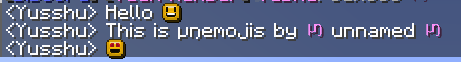

# creative-glyphs

A creative plugin that brings the default Minecraft UI to life by
adding custom glyphs to anywhere you can write text. `creative-glyphs`
also supports  using glyphs as emojis, like ":smiley:", ":heart:", "<3",
":P", etc.

`creative-glyphs` uses [creative](https://unnamed.team/docs/creative),
*the library for resource-packs*, [creative-central](https://unnamed.team/docs/creative-central),
*the plugin that unifies resource-packs*. `creative-glyphs` also supports
placeholder systems like [MiniPlaceholders](https://github.com/MiniPlaceholders/MiniPlaceholders)
or [PlaceholderAPI](https://github.com/PlaceholderAPI/PlaceholderAPI)

